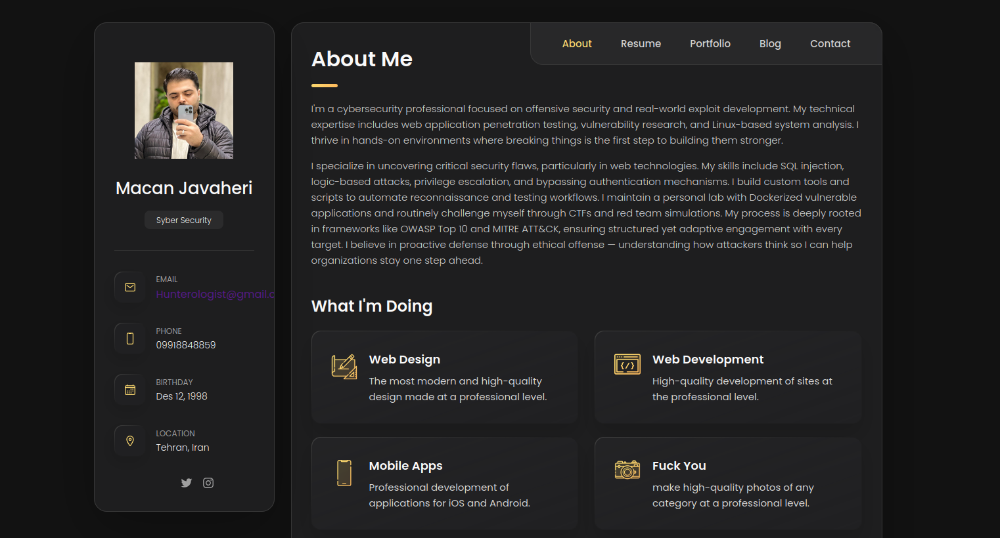

# Hunterologis - Personal portfolio


[](https://twitter.com/intent/follow?screen_name=Hunterologist)

 Personal portfolio is a fully responsive personal portfolio website, responsive for all devices, built using HTML, CSS, and JavaScript.

## Demo



## Prerequisites

Before you begin, ensure you have met the following requirements:

* [Git](https://git-scm.com/downloads "Download Git") must be installed on your operating system.

## Installing 

To install **Hunterologist**, follow these steps:

Linux and macOS:

```bash
sudo git clone https://github.com/hunterologist/hunterologist.github.io
```

Windows:

```bash
git clone https://github.com/hunterologist/hunterologist.github.io
```

## Contact

If you want to contact me you can reach me at [Twitter](https://www.twitter.com/Hunterologist).

## License

MIT
